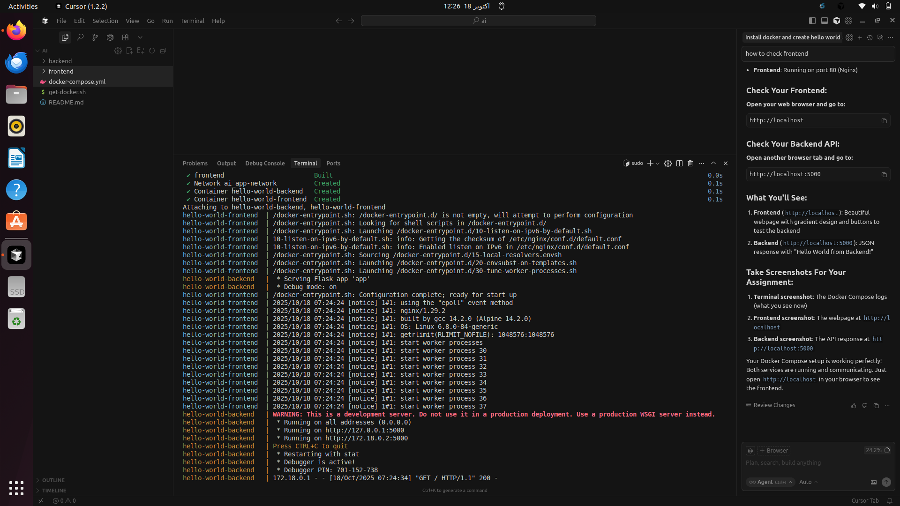

# Docker Assignment Project
## Hello World Backend and Frontend with Docker Compose

This project demonstrates a simple backend-frontend application containerized with Docker and orchestrated with Docker Compose.

### Project Structure
```
ai/
├── backend/
│   ├── app.py              # Flask backend application
│   ├── requirements.txt    # Python dependencies
│   └── Dockerfile          # Backend container configuration
├── frontend/
│   ├── index.html          # Frontend application
│   └── Dockerfile          # Frontend container configuration
└── docker-compose.yml      # Multi-container orchestration
```

### Services
- **Backend**: Flask API running on port 5000
- **Frontend**: Nginx serving static HTML on port 80

### How to Run

1. **Install Docker** (if not already installed):
   ```bash
   sudo apt update
   sudo apt install docker.io docker-compose
   sudo systemctl start docker
   sudo systemctl enable docker
   ```

2. **Build and run with Docker Compose**:
   ```bash
   docker-compose up --build
   ```

3. **Access the application**:
   - Frontend: http://localhost
   - Backend API: http://localhost:5000

### API Endpoints
- `GET /` - Returns hello world message
- `GET /health` - Health check endpoint

### Docker Commands
```bash
# Build and start all services
docker-compose up --build

# Run in background
docker-compose up -d

# Stop services
docker-compose down

# View logs
docker-compose logs

# Rebuild specific service
docker-compose up --build backend
```
